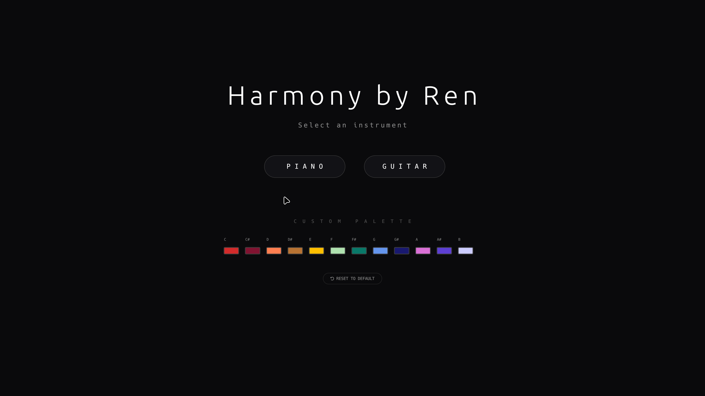
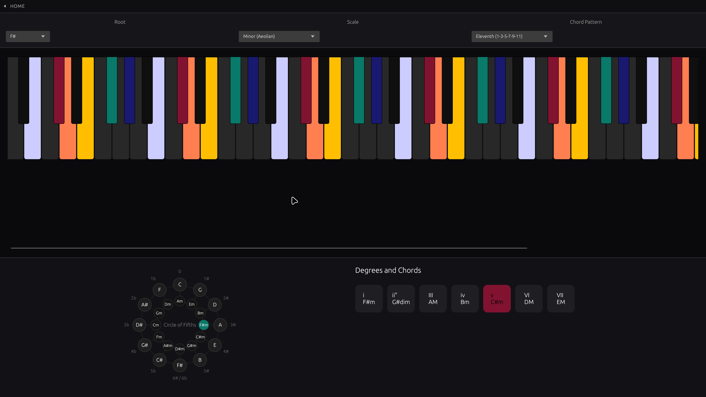
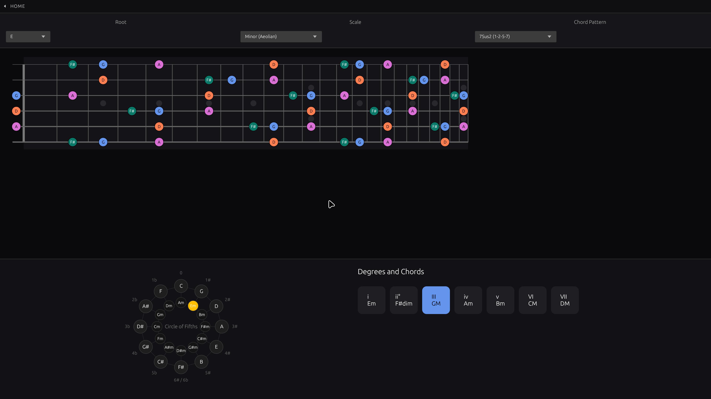

<div align="center">

| | | |
|:---:|:---:|:---:|
|  |  |  |
| *home* | *piano* | *guitar* |

</div>

## · audio dependencies

| distro          | command                                      |
| --------------- | -------------------------------------------- |
| arch based      | `sudo pacman -S alsa-lib pkg-config`         |
| debian / ubuntu | `sudo apt install libasound2-dev pkg-config` |
| fedora          | `sudo dnf install alsa-lib-devel pkg-config` |
| opensuse        | `sudo zypper install alsa-devel pkg-config`  |

## · install

grab `harmony.AppImage` from [releases](https://github.com/lorediggia/harmony-lab/releases) →

```bash
chmod +x harmony.AppImage && ./harmony.AppImage
```

## · build from source

```bash
git clone https://github.com/lorediggia/harmony-lab.git
cd harmony-lab/harmony-lab
cargo run --release
```
